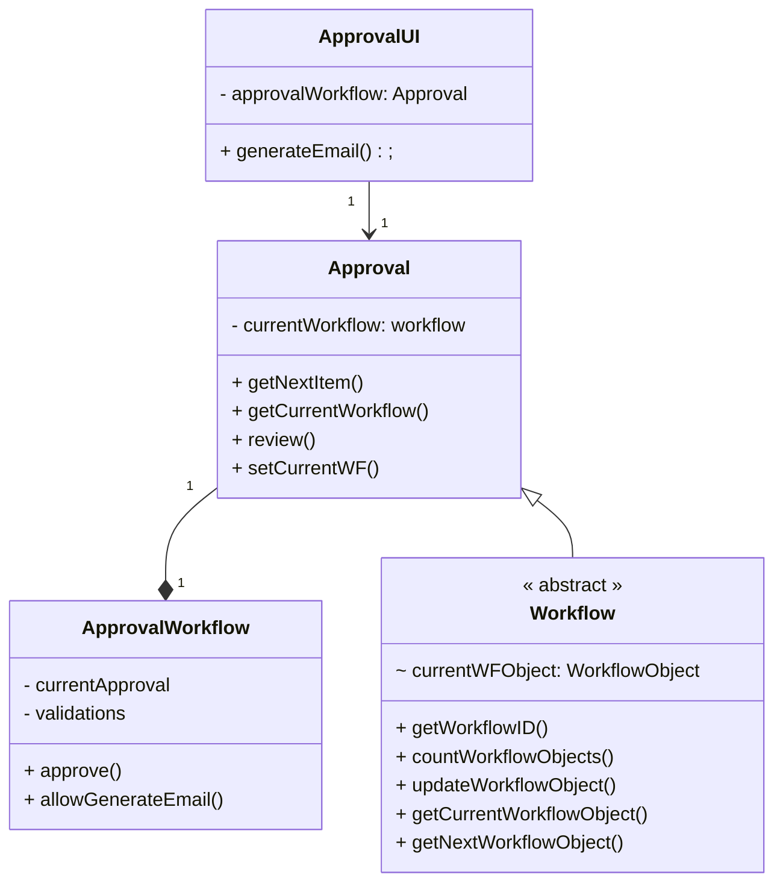

```mermaid
classDiagram
class Approval {
    - currentWorkflow: workflow

    + getNextItem()
    + getCurrentWorkflow()
    + review()
    + setCurrentWF()
}

class ApprovalWorkflow {
    - currentApproval
    - validations

    + approve()
    + allowGenerateEmail()

}

class Workflow {
    << abstract >>
    ~ currentWFObject: WorkflowObject
    + getWorkflowID()
    + countWorkflowObjects()
    + updateWorkflowObject()
    + getCurrentWorkflowObject()
    + getNextWorkflowObject()
}

class ApprovalUI {
    - approvalWorkflow: Approval
    + generateEmail();
}

Approval "1" --* "1" ApprovalWorkflow
Approval  <|-- Workflow
ApprovalUI "1" --> "1" Approval
```
