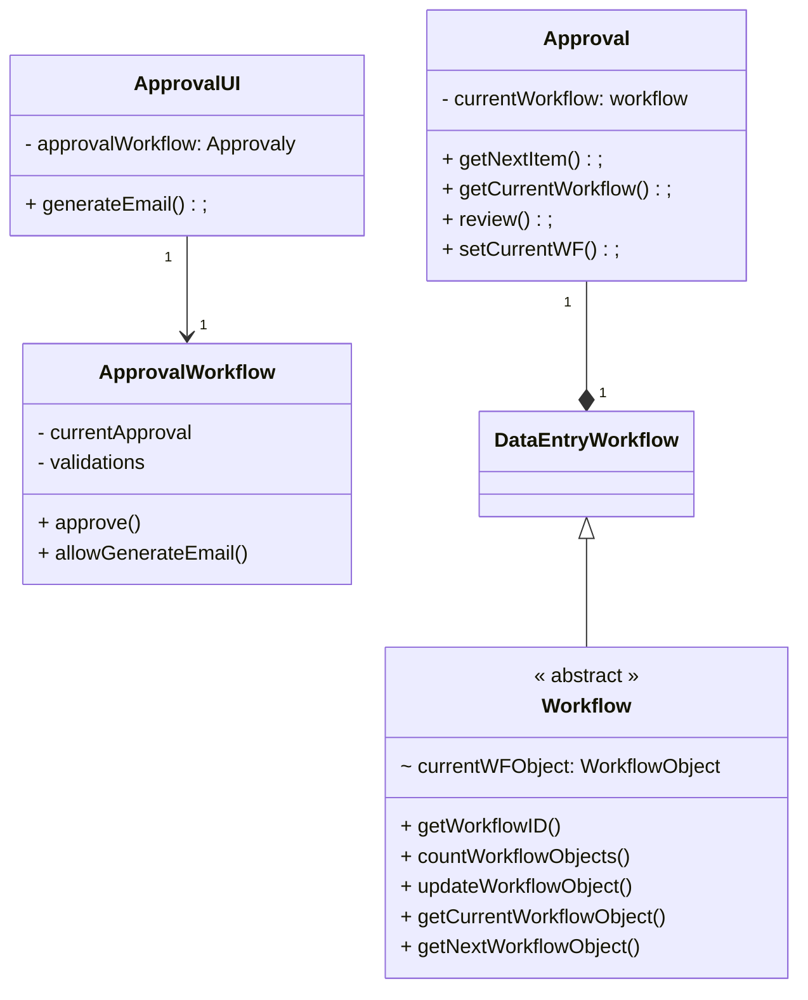

```mermaid
classDiagram
class Approval {
    - currentWorkflow: workflow

    + getNextItem();
    + getCurrentWorkflow();
    + review();
    + setCurrentWF();
}

class ApprovalWorkflow {
    - currentApproval
    - validations

    + approve()
    + allowGenerateEmail()

}

class Workflow {
    << abstract >>
    ~ currentWFObject: WorkflowObject
    + getWorkflowID()
    + countWorkflowObjects()
    + updateWorkflowObject()
    + getCurrentWorkflowObject()
    + getNextWorkflowObject()
}

class ApprovalUI {
    - approvalWorkflow: Approvaly
    + generateEmail();
}

Approval "1" --* "1" DataEntryWorkflow
DataEntryWorkflow  <|-- Workflow
ApprovalUI "1" --> "1" ApprovalWorkflow
```
