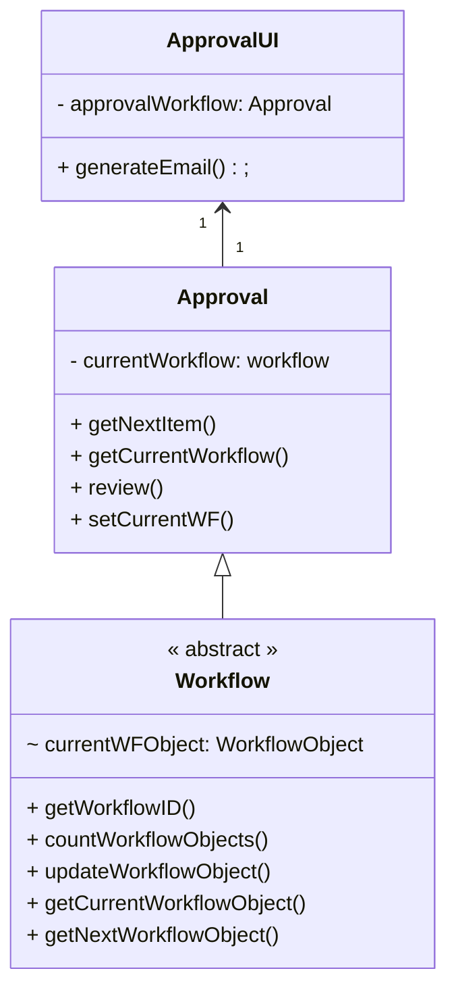

```mermaid
classDiagram
class Approval {
    - currentWorkflow: workflow

    + getNextItem()
    + getCurrentWorkflow()
    + review()
    + setCurrentWF()
}


class Workflow {
    << abstract >>
    ~ currentWFObject: WorkflowObject
    + getWorkflowID()
    + countWorkflowObjects()
    + updateWorkflowObject()
    + getCurrentWorkflowObject()
    + getNextWorkflowObject()
}

class ApprovalUI {
    - approvalWorkflow: Approval
    + generateEmail();
}

Approval  <|-- Workflow
ApprovalUI "1" <-- "1" Approval
```
