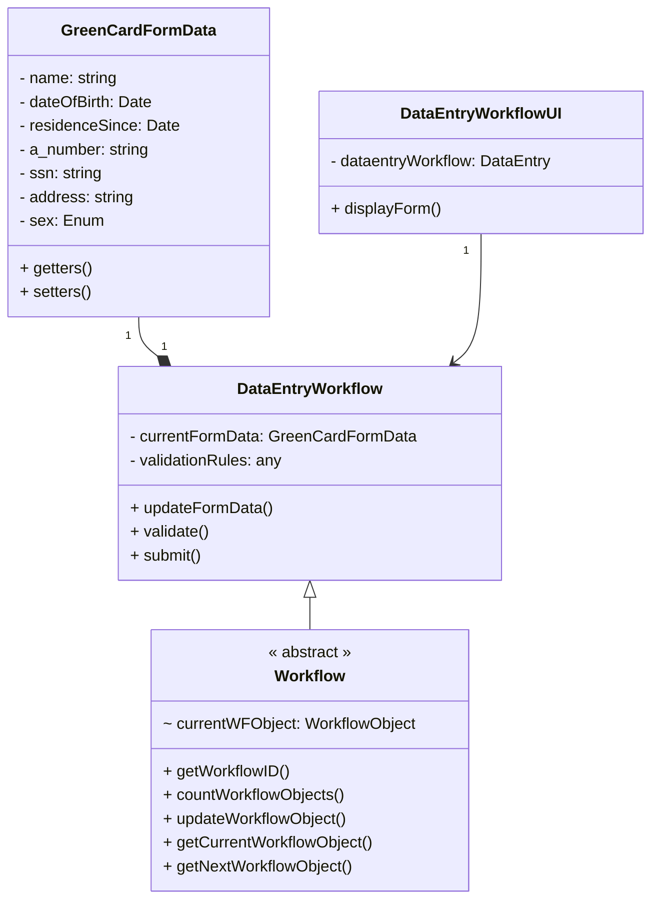

```mermaid
classDiagram
class GreenCardFormData {
    - name: string
    - dateOfBirth: Date
    - residenceSince: Date
    - a_number: string
    - ssn: string
    - address: string
    - sex: Enum

    + getters()
    + setters()
}

class DataEntryWorkflow {
    - currentFormData: GreenCardFormData
    - validationRules: any

    + updateFormData()
    + validate()
    + submit()
}

class Workflow {
    << abstract >>
    ~ currentWFObject: WorkflowObject
    + getWorkflowID()
    + countWorkflowObjects()
    + updateWorkflowObject()
    + getCurrentWorkflowObject()
    + getNextWorkflowObject()
}

class DataEntryWorkflowUI {
    - dataentryWorkflow: DataEntry
    + displayForm()
}

GreenCardFormData "1" --* "1" DataEntryWorkflow
DataEntryWorkflow  <|-- Workflow
DataEntryWorkflowUI "1" --> "1" DataEntryWorkflow
```
