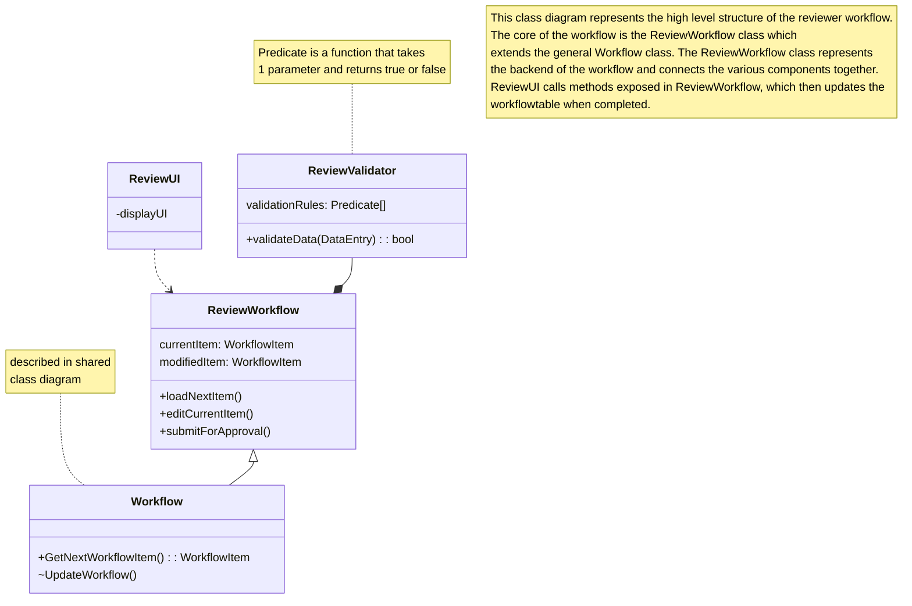

```mermaid
classDiagram
class ReviewUI {
 -displayUI
}

class ReviewValidator {
validationRules: Predicate[]
+validateData(DataEntry): bool
}
note for ReviewValidator "Predicate is a function that takes
1 parameter and returns true or false"
endnote

class ReviewWorkflow {
currentItem: WorkflowItem
modifiedItem: WorkflowItem
+loadNextItem()
+editCurrentItem()
+submitForApproval()

}

note for Workflow "described in shared
class diagram"

class Workflow {
+GetNextWorkflowItem(): WorkflowItem
~UpdateWorkflow()
}
ReviewUI ..> ReviewWorkflow
ReviewWorkflow <|-- Workflow
ReviewValidator --* ReviewWorkflow

note "This class diagram represents the high level structure of the reviewer workflow.
The core of the workflow is the ReviewWorkflow class which
extends the general Workflow class. The ReviewWorkflow class represents
the backend of the workflow and connects the various components together.
ReviewUI calls methods exposed in ReviewWorkflow, which then updates the
workflowtable when completed."
endnote


```