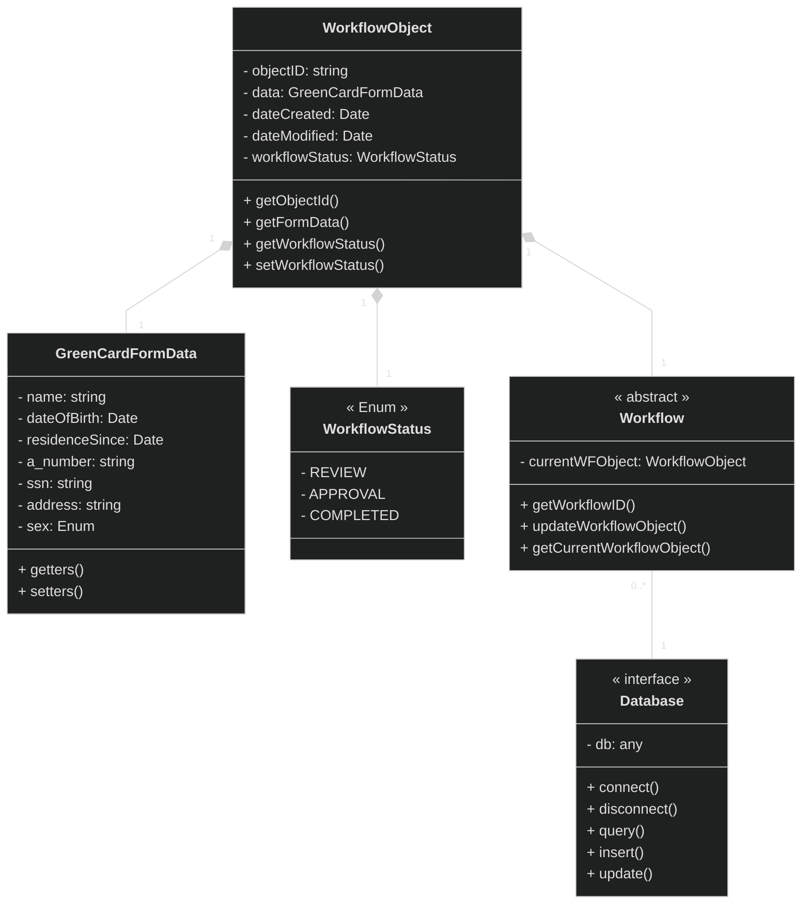

```mermaid
%%{ init : { "theme" : "dark", "flowchart" : { "curve" : "linear" }}}%%
classDiagram
    class GreenCardFormData {
        - name: string
        - dateOfBirth: Date
        - residenceSince: Date
        - a_number: string
        - ssn: string
        - address: string
        - sex: Enum

        + getters()
        + setters()
    }

    class WorkflowObject {
        - objectID: string
        - data: GreenCardFormData
        - dateCreated: Date
        - dateModified: Date
        - workflowStatus: WorkflowStatus
        + getObjectId()
        + getFormData()
        + getWorkflowStatus()
        + setWorkflowStatus()
    }

    class WorkflowStatus {
        << Enum >>
        - REVIEW
        - APPROVAL
        - COMPLETED
    }

    class Workflow {
        << abstract >>
        - currentWFObject: WorkflowObject
        + getWorkflowID()
        + updateWorkflowObject()
        + getCurrentWorkflowObject()
    }

    class Database {
        << interface >>
        - db: any
        + connect()
        + disconnect()
        + query()
        + insert()
        + update()
    }
    WorkflowObject "1" *-- "1" GreenCardFormData
    WorkflowObject "1" *-- "1" WorkflowStatus
    WorkflowObject "1" *-- "1" Workflow
    Workflow "0..*" -- "1" Database

```